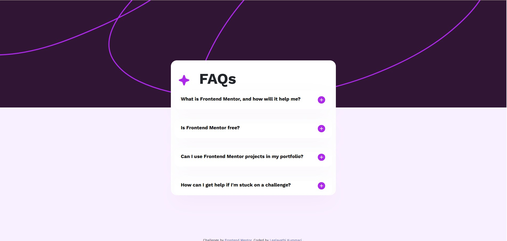
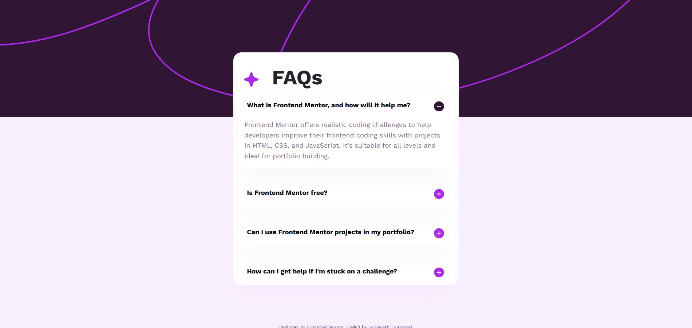

# Frontend Mentor - FAQ accordion solution

This is a solution to the [FAQ accordion challenge on Frontend Mentor](https://www.frontendmentor.io/challenges/faq-accordion-wyfFdeBwBz).

## Table of contents

- [Overview](#overview)
  - [The challenge](#the-challenge)
  - [Screenshot](#screenshot)
  - [Links](#links)
- [My process](#my-process)
  - [Built with](#built-with)
  - [What I learned](#what-i-learned)
  - [Continued development](#continued-development)
  - [Useful resources](#useful-resources)
- [Author](#author)
- [Acknowledgments](#acknowledgments)

## Overview

### The challenge

Users should be able to:

- Hide/Show the answer to a question when the question is clicked
- Navigate the questions and hide/show answers using keyboard navigation alone
- View the optimal layout for the interface depending on their device's screen size
- See hover and focus states for all interactive elements on the page

### Screenshot

### Links

- Solution URL: (https://github.com/lillyleela/faq-accordion)
- Live Site URL: ( https://lillyleela.github.io/faq-accordion/)

## My process

### Built with

- Semantic HTML5 markup
- CSS custom properties
- Flexbox
- Mobile-first workflow
- Vanilla JavaScript
- Bootstrap 5 (utility classes)

### What I learned

This project gave me hands-on experience in building an interactive and responsive FAQ accordion. I improved my understanding of semantic HTML, responsive design with Flexbox, and JavaScript DOM manipulation. I also learned how to implement accessibility features such as `aria-expanded` and `aria-controls`, making the accordion usable for keyboard and screen reader users.

### Continued development

For future projects, I would like to:

- Build more interactive components using JavaScript.
- Improve my understanding of accessibility (ARIA attributes and keyboard navigation).
- Write cleaner and more maintainable CSS using reusable classes.
- Learn CSS Grid and apply it alongside Flexbox for complex layouts.
- Continue developing responsive, mobile-first websites.

### Useful resources

- [MDN Web Docs](https://developer.mozilla.org/) - An excellent reference for HTML, CSS, and JavaScript. I used it to better understand DOM manipulation and accessibility attributes.
- [CSS Tricks - Flexbox Guide](https://css-tricks.com/snippets/css/a-guide-to-flexbox/) - A helpful guide for creating responsive layouts using Flexbox.
- [Frontend Mentor](https://www.frontendmentor.io/) - The challenge platform that provided the design and helped me practice building responsive, real-world UI components.
- [Google Fonts](https://fonts.google.com/) - Used to import the **Work Sans** font to match the design specification.

## Author

- Frontend Mentor - [@Leela](https://www.frontendmentor.io/profile/lillyleela)
